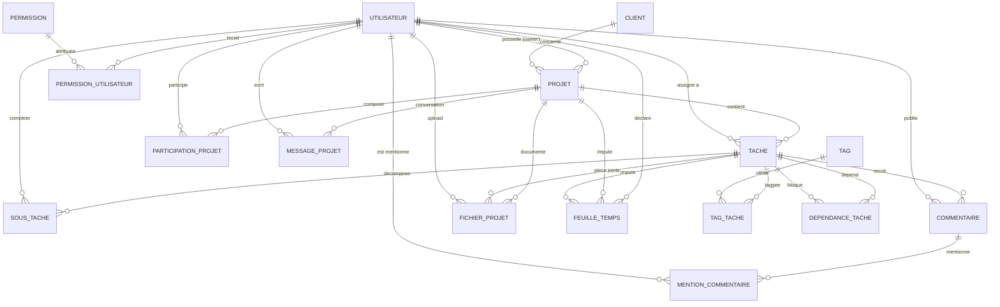
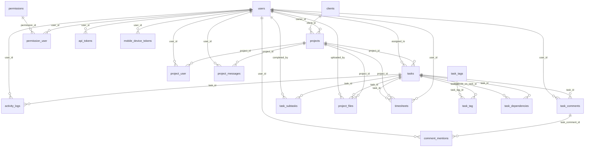

# Base de Donnees Complete - FAL PMS

Version alignee au code actuel (migrations jusqu'au `2026_05_10_000016`).

## 1) MCD (Modele Conceptuel de Donnees)

Entites metier principales:
- Utilisateur
- Client
- Projet
- Tache
- SousTache
- Commentaire
- MessageProjet
- FichierProjet
- FeuilleTemps
- Permission
- Notification
- Tag

Associations metier:
- ParticipationProjet (`project_user`)
- PermissionUtilisateur (`permission_user`)
- MentionCommentaire (`comment_mentions`)
- TagTache (`task_tag`)
- DependanceTache (`task_dependencies`)



## 2) MLD (Modele Logique de Donnees)



## 3) MPD (Modele Physique de Donnees)

Technologie cible:
- SGBD: MySQL 8+ / MariaDB 10.6+
- Moteur: InnoDB
- Charset: `utf8mb4`
- Collation conseillee: `utf8mb4_unicode_ci`

Notes MPD:
- Les tables techniques Laravel sont incluses: `sessions`, `cache`, `jobs`, `failed_jobs`, etc.
- Les cardinalites N-N sont materialisees par tables pivots:
  - `project_user`
  - `permission_user`
  - `task_tag`
  - `task_dependencies`
- Les notifications utilisent un modele polymorphique:
  - `notifications.notifiable_type`
  - `notifications.notifiable_id`

## 4) SQL Complet (Creation Base + Tables + FKs + Index)

```sql
-- ============================================================
-- FAL PMS - Complete SQL Schema
-- Target: MySQL 8+ / MariaDB 10.6+
-- ============================================================

SET NAMES utf8mb4;
SET FOREIGN_KEY_CHECKS = 0;

-- Drop in dependency-safe order
DROP TABLE IF EXISTS task_dependencies;
DROP TABLE IF EXISTS task_tag;
DROP TABLE IF EXISTS task_tags;
DROP TABLE IF EXISTS comment_mentions;
DROP TABLE IF EXISTS mobile_device_tokens;
DROP TABLE IF EXISTS api_tokens;
DROP TABLE IF EXISTS timesheets;
DROP TABLE IF EXISTS project_files;
DROP TABLE IF EXISTS project_messages;
DROP TABLE IF EXISTS task_subtasks;
DROP TABLE IF EXISTS notifications;
DROP TABLE IF EXISTS task_comments;
DROP TABLE IF EXISTS activity_logs;
DROP TABLE IF EXISTS permission_user;
DROP TABLE IF EXISTS permissions;
DROP TABLE IF EXISTS project_user;
DROP TABLE IF EXISTS tasks;
DROP TABLE IF EXISTS projects;
DROP TABLE IF EXISTS clients;
DROP TABLE IF EXISTS failed_jobs;
DROP TABLE IF EXISTS job_batches;
DROP TABLE IF EXISTS jobs;
DROP TABLE IF EXISTS cache_locks;
DROP TABLE IF EXISTS cache;
DROP TABLE IF EXISTS sessions;
DROP TABLE IF EXISTS password_reset_tokens;
DROP TABLE IF EXISTS users;

SET FOREIGN_KEY_CHECKS = 1;

CREATE DATABASE IF NOT EXISTS fal_pms
  CHARACTER SET utf8mb4
  COLLATE utf8mb4_unicode_ci;

USE fal_pms;

-- ------------------------------------------------------------
-- Core auth tables
-- ------------------------------------------------------------

CREATE TABLE users (
  id BIGINT UNSIGNED NOT NULL AUTO_INCREMENT,
  name VARCHAR(255) NOT NULL,
  job_title VARCHAR(120) NULL,
  email VARCHAR(255) NOT NULL,
  phone VARCHAR(60) NULL,
  bio TEXT NULL,
  avatar_path VARCHAR(255) NULL,
  notify_email TINYINT(1) NOT NULL DEFAULT 1,
  notify_realtime TINYINT(1) NOT NULL DEFAULT 1,
  notify_push TINYINT(1) NOT NULL DEFAULT 1,
  email_verified_at TIMESTAMP NULL,
  password VARCHAR(255) NOT NULL,
  remember_token VARCHAR(100) NULL,
  is_admin TINYINT(1) NOT NULL DEFAULT 0,
  role VARCHAR(32) NOT NULL DEFAULT 'member',
  is_active TINYINT(1) NOT NULL DEFAULT 1,
  last_seen_at TIMESTAMP NULL,
  created_at TIMESTAMP NULL,
  updated_at TIMESTAMP NULL,
  PRIMARY KEY (id),
  UNIQUE KEY users_email_unique (email),
  KEY users_role_index (role),
  KEY users_is_active_index (is_active),
  KEY users_last_seen_at_index (last_seen_at)
) ENGINE=InnoDB DEFAULT CHARSET=utf8mb4 COLLATE=utf8mb4_unicode_ci;

CREATE TABLE password_reset_tokens (
  email VARCHAR(255) NOT NULL,
  token VARCHAR(255) NOT NULL,
  created_at TIMESTAMP NULL,
  PRIMARY KEY (email)
) ENGINE=InnoDB DEFAULT CHARSET=utf8mb4 COLLATE=utf8mb4_unicode_ci;

CREATE TABLE sessions (
  id VARCHAR(255) NOT NULL,
  user_id BIGINT UNSIGNED NULL,
  ip_address VARCHAR(45) NULL,
  user_agent TEXT NULL,
  payload LONGTEXT NOT NULL,
  last_activity INT NOT NULL,
  PRIMARY KEY (id),
  KEY sessions_user_id_index (user_id),
  KEY sessions_last_activity_index (last_activity)
) ENGINE=InnoDB DEFAULT CHARSET=utf8mb4 COLLATE=utf8mb4_unicode_ci;

-- ------------------------------------------------------------
-- Framework cache / queue tables
-- ------------------------------------------------------------

CREATE TABLE cache (
  `key` VARCHAR(255) NOT NULL,
  `value` MEDIUMTEXT NOT NULL,
  expiration INT NOT NULL,
  PRIMARY KEY (`key`)
) ENGINE=InnoDB DEFAULT CHARSET=utf8mb4 COLLATE=utf8mb4_unicode_ci;

CREATE TABLE cache_locks (
  `key` VARCHAR(255) NOT NULL,
  owner VARCHAR(255) NOT NULL,
  expiration INT NOT NULL,
  PRIMARY KEY (`key`)
) ENGINE=InnoDB DEFAULT CHARSET=utf8mb4 COLLATE=utf8mb4_unicode_ci;

CREATE TABLE jobs (
  id BIGINT UNSIGNED NOT NULL AUTO_INCREMENT,
  queue VARCHAR(255) NOT NULL,
  payload LONGTEXT NOT NULL,
  attempts TINYINT UNSIGNED NOT NULL,
  reserved_at INT UNSIGNED NULL,
  available_at INT UNSIGNED NOT NULL,
  created_at INT UNSIGNED NOT NULL,
  PRIMARY KEY (id),
  KEY jobs_queue_index (queue)
) ENGINE=InnoDB DEFAULT CHARSET=utf8mb4 COLLATE=utf8mb4_unicode_ci;

CREATE TABLE job_batches (
  id VARCHAR(255) NOT NULL,
  name VARCHAR(255) NOT NULL,
  total_jobs INT NOT NULL,
  pending_jobs INT NOT NULL,
  failed_jobs INT NOT NULL,
  failed_job_ids LONGTEXT NOT NULL,
  options MEDIUMTEXT NULL,
  cancelled_at INT NULL,
  created_at INT NOT NULL,
  finished_at INT NULL,
  PRIMARY KEY (id)
) ENGINE=InnoDB DEFAULT CHARSET=utf8mb4 COLLATE=utf8mb4_unicode_ci;

CREATE TABLE failed_jobs (
  id BIGINT UNSIGNED NOT NULL AUTO_INCREMENT,
  uuid VARCHAR(255) NOT NULL,
  connection TEXT NOT NULL,
  queue TEXT NOT NULL,
  payload LONGTEXT NOT NULL,
  exception LONGTEXT NOT NULL,
  failed_at TIMESTAMP NOT NULL DEFAULT CURRENT_TIMESTAMP,
  PRIMARY KEY (id),
  UNIQUE KEY failed_jobs_uuid_unique (uuid)
) ENGINE=InnoDB DEFAULT CHARSET=utf8mb4 COLLATE=utf8mb4_unicode_ci;

-- ------------------------------------------------------------
-- Business tables
-- ------------------------------------------------------------

CREATE TABLE clients (
  id BIGINT UNSIGNED NOT NULL AUTO_INCREMENT,
  name VARCHAR(180) NOT NULL,
  company VARCHAR(180) NULL,
  email VARCHAR(180) NULL,
  phone VARCHAR(80) NULL,
  notes TEXT NULL,
  is_active TINYINT(1) NOT NULL DEFAULT 1,
  created_at TIMESTAMP NULL,
  updated_at TIMESTAMP NULL,
  PRIMARY KEY (id),
  KEY clients_name_index (name),
  KEY clients_is_active_index (is_active)
) ENGINE=InnoDB DEFAULT CHARSET=utf8mb4 COLLATE=utf8mb4_unicode_ci;

CREATE TABLE projects (
  id BIGINT UNSIGNED NOT NULL AUTO_INCREMENT,
  created_at TIMESTAMP NULL,
  updated_at TIMESTAMP NULL,
  owner_id BIGINT UNSIGNED NULL,
  client_id BIGINT UNSIGNED NULL,
  name VARCHAR(255) NOT NULL DEFAULT 'Nouveau projet',
  description TEXT NULL,
  objective TEXT NULL,
  status VARCHAR(255) NOT NULL DEFAULT 'planning',
  is_template TINYINT(1) NOT NULL DEFAULT 0,
  template_name VARCHAR(180) NULL,
  priority VARCHAR(255) NOT NULL DEFAULT 'medium',
  budget DECIMAL(12,2) NULL,
  start_date DATE NULL,
  due_date DATE NULL,
  is_archived TINYINT(1) NOT NULL DEFAULT 0,
  archived_at TIMESTAMP NULL,
  completed_at TIMESTAMP NULL,
  PRIMARY KEY (id),
  KEY projects_status_index (status),
  KEY projects_priority_index (priority),
  KEY projects_due_date_index (due_date),
  KEY projects_client_id_index (client_id),
  KEY projects_is_template_is_archived_index (is_template, is_archived),
  CONSTRAINT projects_owner_id_foreign
    FOREIGN KEY (owner_id) REFERENCES users(id)
    ON DELETE SET NULL,
  CONSTRAINT projects_client_id_foreign
    FOREIGN KEY (client_id) REFERENCES clients(id)
    ON DELETE SET NULL
) ENGINE=InnoDB DEFAULT CHARSET=utf8mb4 COLLATE=utf8mb4_unicode_ci;

CREATE TABLE tasks (
  id BIGINT UNSIGNED NOT NULL AUTO_INCREMENT,
  created_at TIMESTAMP NULL,
  updated_at TIMESTAMP NULL,
  project_id BIGINT UNSIGNED NULL,
  assigned_to BIGINT UNSIGNED NULL,
  title VARCHAR(255) NOT NULL DEFAULT 'Nouvelle tache',
  description TEXT NULL,
  status VARCHAR(255) NOT NULL DEFAULT 'todo',
  is_in_review TINYINT(1) NOT NULL DEFAULT 0,
  priority VARCHAR(255) NOT NULL DEFAULT 'medium',
  estimated_hours INT UNSIGNED NULL,
  due_date DATETIME NULL,
  completed_at TIMESTAMP NULL,
  position INT UNSIGNED NOT NULL DEFAULT 0,
  PRIMARY KEY (id),
  KEY tasks_status_index (status),
  KEY tasks_priority_index (priority),
  KEY tasks_due_date_index (due_date),
  CONSTRAINT tasks_project_id_foreign
    FOREIGN KEY (project_id) REFERENCES projects(id)
    ON DELETE CASCADE,
  CONSTRAINT tasks_assigned_to_foreign
    FOREIGN KEY (assigned_to) REFERENCES users(id)
    ON DELETE SET NULL
) ENGINE=InnoDB DEFAULT CHARSET=utf8mb4 COLLATE=utf8mb4_unicode_ci;

CREATE TABLE project_user (
  id BIGINT UNSIGNED NOT NULL AUTO_INCREMENT,
  project_id BIGINT UNSIGNED NOT NULL,
  user_id BIGINT UNSIGNED NOT NULL,
  role VARCHAR(32) NOT NULL DEFAULT 'member',
  is_active TINYINT(1) NOT NULL DEFAULT 1,
  created_at TIMESTAMP NULL,
  updated_at TIMESTAMP NULL,
  PRIMARY KEY (id),
  UNIQUE KEY project_user_project_id_user_id_unique (project_id, user_id),
  KEY project_user_role_index (role),
  KEY project_user_is_active_index (is_active),
  CONSTRAINT project_user_project_id_foreign
    FOREIGN KEY (project_id) REFERENCES projects(id)
    ON DELETE CASCADE,
  CONSTRAINT project_user_user_id_foreign
    FOREIGN KEY (user_id) REFERENCES users(id)
    ON DELETE CASCADE
) ENGINE=InnoDB DEFAULT CHARSET=utf8mb4 COLLATE=utf8mb4_unicode_ci;

CREATE TABLE activity_logs (
  id BIGINT UNSIGNED NOT NULL AUTO_INCREMENT,
  task_id BIGINT UNSIGNED NOT NULL,
  user_id BIGINT UNSIGNED NULL,
  action VARCHAR(80) NOT NULL,
  meta JSON NULL,
  created_at TIMESTAMP NULL,
  updated_at TIMESTAMP NULL,
  PRIMARY KEY (id),
  KEY activity_logs_action_index (action),
  KEY activity_logs_created_at_index (created_at),
  CONSTRAINT activity_logs_task_id_foreign
    FOREIGN KEY (task_id) REFERENCES tasks(id)
    ON DELETE CASCADE,
  CONSTRAINT activity_logs_user_id_foreign
    FOREIGN KEY (user_id) REFERENCES users(id)
    ON DELETE SET NULL
) ENGINE=InnoDB DEFAULT CHARSET=utf8mb4 COLLATE=utf8mb4_unicode_ci;

CREATE TABLE task_comments (
  id BIGINT UNSIGNED NOT NULL AUTO_INCREMENT,
  task_id BIGINT UNSIGNED NOT NULL,
  user_id BIGINT UNSIGNED NULL,
  body TEXT NOT NULL,
  created_at TIMESTAMP NULL,
  updated_at TIMESTAMP NULL,
  PRIMARY KEY (id),
  KEY task_comments_created_at_index (created_at),
  CONSTRAINT task_comments_task_id_foreign
    FOREIGN KEY (task_id) REFERENCES tasks(id)
    ON DELETE CASCADE,
  CONSTRAINT task_comments_user_id_foreign
    FOREIGN KEY (user_id) REFERENCES users(id)
    ON DELETE SET NULL
) ENGINE=InnoDB DEFAULT CHARSET=utf8mb4 COLLATE=utf8mb4_unicode_ci;

CREATE TABLE permissions (
  id BIGINT UNSIGNED NOT NULL AUTO_INCREMENT,
  code VARCHAR(120) NOT NULL,
  label VARCHAR(180) NOT NULL,
  description TEXT NULL,
  created_at TIMESTAMP NULL,
  updated_at TIMESTAMP NULL,
  PRIMARY KEY (id),
  UNIQUE KEY permissions_code_unique (code)
) ENGINE=InnoDB DEFAULT CHARSET=utf8mb4 COLLATE=utf8mb4_unicode_ci;

CREATE TABLE permission_user (
  id BIGINT UNSIGNED NOT NULL AUTO_INCREMENT,
  permission_id BIGINT UNSIGNED NOT NULL,
  user_id BIGINT UNSIGNED NOT NULL,
  created_at TIMESTAMP NULL,
  updated_at TIMESTAMP NULL,
  PRIMARY KEY (id),
  UNIQUE KEY permission_user_permission_id_user_id_unique (permission_id, user_id),
  CONSTRAINT permission_user_permission_id_foreign
    FOREIGN KEY (permission_id) REFERENCES permissions(id)
    ON DELETE CASCADE,
  CONSTRAINT permission_user_user_id_foreign
    FOREIGN KEY (user_id) REFERENCES users(id)
    ON DELETE CASCADE
) ENGINE=InnoDB DEFAULT CHARSET=utf8mb4 COLLATE=utf8mb4_unicode_ci;

CREATE TABLE notifications (
  id CHAR(36) NOT NULL,
  type VARCHAR(255) NOT NULL,
  notifiable_type VARCHAR(255) NOT NULL,
  notifiable_id BIGINT UNSIGNED NOT NULL,
  data TEXT NOT NULL,
  read_at TIMESTAMP NULL,
  created_at TIMESTAMP NULL,
  updated_at TIMESTAMP NULL,
  PRIMARY KEY (id),
  KEY notifications_notifiable_type_notifiable_id_index (notifiable_type, notifiable_id),
  KEY notifications_read_at_index (read_at)
) ENGINE=InnoDB DEFAULT CHARSET=utf8mb4 COLLATE=utf8mb4_unicode_ci;

CREATE TABLE task_subtasks (
  id BIGINT UNSIGNED NOT NULL AUTO_INCREMENT,
  task_id BIGINT UNSIGNED NOT NULL,
  title VARCHAR(255) NOT NULL,
  is_completed TINYINT(1) NOT NULL DEFAULT 0,
  completed_by BIGINT UNSIGNED NULL,
  completed_at TIMESTAMP NULL,
  position INT UNSIGNED NOT NULL DEFAULT 1,
  created_at TIMESTAMP NULL,
  updated_at TIMESTAMP NULL,
  PRIMARY KEY (id),
  KEY task_subtasks_task_id_is_completed_index (task_id, is_completed),
  KEY task_subtasks_task_id_position_index (task_id, position),
  CONSTRAINT task_subtasks_task_id_foreign
    FOREIGN KEY (task_id) REFERENCES tasks(id)
    ON DELETE CASCADE,
  CONSTRAINT task_subtasks_completed_by_foreign
    FOREIGN KEY (completed_by) REFERENCES users(id)
    ON DELETE SET NULL
) ENGINE=InnoDB DEFAULT CHARSET=utf8mb4 COLLATE=utf8mb4_unicode_ci;

CREATE TABLE project_messages (
  id BIGINT UNSIGNED NOT NULL AUTO_INCREMENT,
  project_id BIGINT UNSIGNED NOT NULL,
  user_id BIGINT UNSIGNED NULL,
  body TEXT NOT NULL,
  mentions JSON NULL,
  created_at TIMESTAMP NULL,
  updated_at TIMESTAMP NULL,
  PRIMARY KEY (id),
  KEY project_messages_project_id_created_at_index (project_id, created_at),
  CONSTRAINT project_messages_project_id_foreign
    FOREIGN KEY (project_id) REFERENCES projects(id)
    ON DELETE CASCADE,
  CONSTRAINT project_messages_user_id_foreign
    FOREIGN KEY (user_id) REFERENCES users(id)
    ON DELETE SET NULL
) ENGINE=InnoDB DEFAULT CHARSET=utf8mb4 COLLATE=utf8mb4_unicode_ci;

CREATE TABLE project_files (
  id BIGINT UNSIGNED NOT NULL AUTO_INCREMENT,
  project_id BIGINT UNSIGNED NOT NULL,
  task_id BIGINT UNSIGNED NULL,
  uploaded_by BIGINT UNSIGNED NULL,
  logical_name VARCHAR(180) NOT NULL,
  version INT UNSIGNED NOT NULL DEFAULT 1,
  original_name VARCHAR(255) NOT NULL,
  stored_path VARCHAR(255) NOT NULL,
  mime_type VARCHAR(120) NULL,
  size BIGINT UNSIGNED NOT NULL DEFAULT 0,
  created_at TIMESTAMP NULL,
  updated_at TIMESTAMP NULL,
  PRIMARY KEY (id),
  UNIQUE KEY project_files_version_unique (project_id, logical_name, version),
  KEY project_files_project_id_logical_name_index (project_id, logical_name),
  KEY project_files_project_id_created_at_index (project_id, created_at),
  CONSTRAINT project_files_project_id_foreign
    FOREIGN KEY (project_id) REFERENCES projects(id)
    ON DELETE CASCADE,
  CONSTRAINT project_files_task_id_foreign
    FOREIGN KEY (task_id) REFERENCES tasks(id)
    ON DELETE SET NULL,
  CONSTRAINT project_files_uploaded_by_foreign
    FOREIGN KEY (uploaded_by) REFERENCES users(id)
    ON DELETE SET NULL
) ENGINE=InnoDB DEFAULT CHARSET=utf8mb4 COLLATE=utf8mb4_unicode_ci;

CREATE TABLE timesheets (
  id BIGINT UNSIGNED NOT NULL AUTO_INCREMENT,
  user_id BIGINT UNSIGNED NOT NULL,
  project_id BIGINT UNSIGNED NOT NULL,
  task_id BIGINT UNSIGNED NULL,
  work_date DATE NOT NULL,
  hours DECIMAL(5,2) NOT NULL,
  note TEXT NULL,
  created_at TIMESTAMP NULL,
  updated_at TIMESTAMP NULL,
  PRIMARY KEY (id),
  KEY timesheets_user_id_work_date_index (user_id, work_date),
  KEY timesheets_project_id_work_date_index (project_id, work_date),
  CONSTRAINT timesheets_user_id_foreign
    FOREIGN KEY (user_id) REFERENCES users(id)
    ON DELETE CASCADE,
  CONSTRAINT timesheets_project_id_foreign
    FOREIGN KEY (project_id) REFERENCES projects(id)
    ON DELETE CASCADE,
  CONSTRAINT timesheets_task_id_foreign
    FOREIGN KEY (task_id) REFERENCES tasks(id)
    ON DELETE SET NULL
) ENGINE=InnoDB DEFAULT CHARSET=utf8mb4 COLLATE=utf8mb4_unicode_ci;

CREATE TABLE api_tokens (
  id BIGINT UNSIGNED NOT NULL AUTO_INCREMENT,
  user_id BIGINT UNSIGNED NOT NULL,
  name VARCHAR(100) NOT NULL DEFAULT 'mobile',
  token_hash VARCHAR(64) NOT NULL,
  abilities JSON NULL,
  last_used_at TIMESTAMP NULL,
  expires_at TIMESTAMP NULL,
  created_at TIMESTAMP NULL,
  updated_at TIMESTAMP NULL,
  PRIMARY KEY (id),
  UNIQUE KEY api_tokens_token_hash_unique (token_hash),
  KEY api_tokens_user_id_expires_at_index (user_id, expires_at),
  CONSTRAINT api_tokens_user_id_foreign
    FOREIGN KEY (user_id) REFERENCES users(id)
    ON DELETE CASCADE
) ENGINE=InnoDB DEFAULT CHARSET=utf8mb4 COLLATE=utf8mb4_unicode_ci;

CREATE TABLE mobile_device_tokens (
  id BIGINT UNSIGNED NOT NULL AUTO_INCREMENT,
  user_id BIGINT UNSIGNED NOT NULL,
  provider VARCHAR(32) NOT NULL DEFAULT 'fcm',
  device_name VARCHAR(100) NULL,
  device_token VARCHAR(255) NOT NULL,
  last_used_at TIMESTAMP NULL,
  revoked_at TIMESTAMP NULL,
  created_at TIMESTAMP NULL,
  updated_at TIMESTAMP NULL,
  PRIMARY KEY (id),
  UNIQUE KEY mobile_device_tokens_device_token_unique (device_token),
  KEY mobile_device_tokens_user_id_revoked_at_index (user_id, revoked_at),
  CONSTRAINT mobile_device_tokens_user_id_foreign
    FOREIGN KEY (user_id) REFERENCES users(id)
    ON DELETE CASCADE
) ENGINE=InnoDB DEFAULT CHARSET=utf8mb4 COLLATE=utf8mb4_unicode_ci;

CREATE TABLE comment_mentions (
  id BIGINT UNSIGNED NOT NULL AUTO_INCREMENT,
  task_comment_id BIGINT UNSIGNED NOT NULL,
  user_id BIGINT UNSIGNED NOT NULL,
  created_at TIMESTAMP NULL,
  updated_at TIMESTAMP NULL,
  PRIMARY KEY (id),
  UNIQUE KEY comment_mentions_task_comment_id_user_id_unique (task_comment_id, user_id),
  CONSTRAINT comment_mentions_task_comment_id_foreign
    FOREIGN KEY (task_comment_id) REFERENCES task_comments(id)
    ON DELETE CASCADE,
  CONSTRAINT comment_mentions_user_id_foreign
    FOREIGN KEY (user_id) REFERENCES users(id)
    ON DELETE CASCADE
) ENGINE=InnoDB DEFAULT CHARSET=utf8mb4 COLLATE=utf8mb4_unicode_ci;

CREATE TABLE task_tags (
  id BIGINT UNSIGNED NOT NULL AUTO_INCREMENT,
  name VARCHAR(80) NOT NULL,
  color VARCHAR(20) NULL,
  created_at TIMESTAMP NULL,
  updated_at TIMESTAMP NULL,
  PRIMARY KEY (id),
  UNIQUE KEY task_tags_name_unique (name)
) ENGINE=InnoDB DEFAULT CHARSET=utf8mb4 COLLATE=utf8mb4_unicode_ci;

CREATE TABLE task_tag (
  id BIGINT UNSIGNED NOT NULL AUTO_INCREMENT,
  task_id BIGINT UNSIGNED NOT NULL,
  task_tag_id BIGINT UNSIGNED NOT NULL,
  created_at TIMESTAMP NULL,
  updated_at TIMESTAMP NULL,
  PRIMARY KEY (id),
  UNIQUE KEY task_tag_task_id_task_tag_id_unique (task_id, task_tag_id),
  KEY task_tag_task_tag_id_index (task_tag_id),
  CONSTRAINT task_tag_task_id_foreign
    FOREIGN KEY (task_id) REFERENCES tasks(id)
    ON DELETE CASCADE,
  CONSTRAINT task_tag_task_tag_id_foreign
    FOREIGN KEY (task_tag_id) REFERENCES task_tags(id)
    ON DELETE CASCADE
) ENGINE=InnoDB DEFAULT CHARSET=utf8mb4 COLLATE=utf8mb4_unicode_ci;

CREATE TABLE task_dependencies (
  id BIGINT UNSIGNED NOT NULL AUTO_INCREMENT,
  task_id BIGINT UNSIGNED NOT NULL,
  depends_on_task_id BIGINT UNSIGNED NOT NULL,
  created_at TIMESTAMP NULL,
  updated_at TIMESTAMP NULL,
  PRIMARY KEY (id),
  UNIQUE KEY task_dependencies_task_id_depends_on_task_id_unique (task_id, depends_on_task_id),
  KEY task_dependencies_depends_on_task_id_index (depends_on_task_id),
  CONSTRAINT task_dependencies_task_id_foreign
    FOREIGN KEY (task_id) REFERENCES tasks(id)
    ON DELETE CASCADE,
  CONSTRAINT task_dependencies_depends_on_task_id_foreign
    FOREIGN KEY (depends_on_task_id) REFERENCES tasks(id)
    ON DELETE CASCADE
) ENGINE=InnoDB DEFAULT CHARSET=utf8mb4 COLLATE=utf8mb4_unicode_ci;
```

## 5) Import Rapide

Depuis MySQL CLI:

```bash
mysql -u root -p < DATABASE_FAL_PMS_COMPLETE.sql
```

Si tu veux utiliser directement ce fichier markdown:
- copie uniquement le bloc SQL dans un fichier `DATABASE_FAL_PMS_COMPLETE.sql`
- execute la commande ci-dessus

