# MEMOIRE DE FIN DE CYCLE - LICENCE PROFESSIONNELLE

## Thème
**Développement d'une plateforme de gestion de projets collaboratifs : cas de FAL-PMS (Futuristic Africa Lab Project Management System)**

## Présenté par
**[Votre nom complet]**

## Option
**Génie Logiciel / Informatique de Gestion**

## Année académique
**2025-2026**

---

## Avant-propos
Ce mémoire présente les travaux menés autour de la conception et du développement d'une plateforme web de gestion de projets collaboratifs, dénommée **FAL-PMS**. Ce projet a permis de mobiliser les compétences acquises en analyse des besoins, modélisation MERISE, développement full-stack Laravel, sécurité applicative et assurance qualité logicielle.

L'objectif principal était de proposer un outil centralisé, moderne et extensible pour améliorer la planification, le suivi et la collaboration entre les équipes projet.

## Dédicace
À ma famille, pour son soutien constant, et à toutes les personnes qui ont contribué à ma progression académique et professionnelle.

## Remerciements
Mes remerciements vont à :
- mes encadreurs académiques et professionnels ;
- l'équipe technique de Futuristic Africa Lab ;
- mes enseignants et collègues pour leurs orientations et conseils.

## Sigles et abréviations
- **API** : Application Programming Interface
- **CRUD** : Create, Read, Update, Delete
- **DB** : Database
- **MCC** : Modèle Conceptuel de Communication
- **MCD** : Modèle Conceptuel de Données
- **MCT** : Modèle Conceptuel des Traitements
- **MLD** : Modèle Logique de Données
- **MOT** : Modèle Organisationnel des Traitements
- **MPD** : Modèle Physique de Données
- **RBAC** : Role Based Access Control
- **SI** : Système d'Information
- **SGBD** : Système de Gestion de Base de Données

---

## Liste des figures
- Figure 1 : Architecture fonctionnelle FAL-PMS
- Figure 2 : Couverture des modules
- Figure 3 : Répartition des routes
- Figure 4 : Résultats des tests
- Figure 5 : Capture dashboard client
- Figure 6 : Capture workspace Scrum/Kanban
- Figure 7 : Capture calendrier des tâches
- Figure 8 : Capture espace admin Filament
- Figure 9 : Flux API mobile
- Figure 10 : Niveaux MERISE
- Figure 11 : MCC
- Figure 12 : MCD
- Figure 13 : MLD
- Figure 14 : MPD
- Figure 15 : MCT
- Figure 16 : MOT

---

## Introduction générale
La transformation numérique des organisations rend indispensable la mise en place d'outils collaboratifs capables de structurer le travail en équipe, de garantir la traçabilité des actions et d'améliorer la qualité de pilotage des projets.

Dans ce contexte, le projet **FAL-PMS** a été conçu pour répondre aux besoins d'une gestion centralisée des projets, tâches, membres, échanges, documents, notifications et rapports.

Le mémoire est organisé en trois chapitres :
1. Présentation du cadre d'étude et problématique.
2. État de l'art et choix méthodologiques.
3. Conception, développement, validation et résultats.

---

# Chapitre I : Présentation du cadre d'étude

## I.1 Contexte organisationnel
Futuristic Africa Lab évolue dans un environnement de projets multiples avec des équipes pluridisciplinaires. Les méthodes manuelles et outils dispersés (messagerie, fichiers isolés, tableurs) limitaient la visibilité en temps réel et ralentissaient la coordination.

## I.2 Étude de l'existant
Constats principaux observés avant FAL-PMS :
- absence d'une plateforme unique de gestion de projets ;
- difficulté de suivi des échéances et responsabilités ;
- faible traçabilité des décisions et commentaires ;
- reporting long et peu standardisé ;
- communication dispersée entre plusieurs canaux.

## I.3 Problématique
**Comment concevoir et développer une plateforme collaborative robuste permettant de planifier, exécuter, suivre et analyser les projets de manière centralisée ?**

Sous-questions :
- Quelles données et règles de gestion modéliser ?
- Quelle architecture technique adopter ?
- Comment sécuriser les accès et droits ?
- Comment fournir des tableaux de bord exploitables ?
- Comment assurer la qualité de la solution ?

## I.4 Objectifs du projet
- Centraliser les processus projet dans une seule application.
- Améliorer la collaboration entre chefs de projets, membres et clients.
- Assurer un suivi granulaire des tâches (priorité, statut, dépendances, temps).
- Automatiser la notification et le reporting.
- Fournir des interfaces distinctes Client/Admin et une API mobile.

## I.5 Solution proposée
La solution retenue est une application web en **Laravel 12**, avec :
- espace **Client** pour l'exploitation métier ;
- espace **Admin Filament** pour l'administration ;
- API REST v1 pour intégration mobile ;
- base relationnelle (SQLite/MySQL) et modèle de permissions RBAC.

---

# Chapitre II : État de l'art et méthodologie

## II.1 Cadre conceptuel de la gestion de projets collaboratifs
La gestion de projets collaboratifs regroupe les méthodes, outils et pratiques qui permettent à plusieurs acteurs (chef de projet, membres d'équipe, client, management) de coordonner leurs activités autour d'objectifs communs, de délais et de livrables mesurables.

Un système de gestion collaborative doit couvrir les dimensions suivantes :
- **Planification** : structuration du projet en tâches, sous-tâches, jalons et priorités.
- **Exécution** : affectation des responsabilités, suivi du statut et remontée d'information terrain.
- **Contrôle** : mesure de l'avancement, gestion des retards, détection des blocages.
- **Communication** : échanges contextualisés (commentaires, mentions, notifications).
- **Capitalisation** : historique des actions, rapports, archivage des documents et décisions.

Ces principes s'inscrivent dans une logique d'amélioration de la transparence opérationnelle et de réduction des pertes d'information.

## II.2 Approches organisationnelles et méthodes de pilotage
Les pratiques dominantes observées dans les environnements numériques de gestion de projets sont :
- **Approche séquentielle** (cycle en V / waterfall) : utile pour les contextes stables, mais peu flexible face aux changements fréquents.
- **Approche agile Scrum** : orientée itérations courtes, revue régulière du backlog, forte implication des parties prenantes.
- **Approche Kanban** : pilotage en flux continu, visualisation des tâches par colonnes et limitation du travail en cours.
- **Approche hybride** : combinaison d'une planification macro structurée et d'une exécution agile au niveau opérationnel.

Pour une plateforme collaborative comme FAL-PMS, les approches Scrum/Kanban sont particulièrement pertinentes car elles offrent :
- une visibilité continue de l'état des tâches ;
- une meilleure adaptation aux changements de priorité ;
- une coordination plus fluide des équipes pluridisciplinaires.

## II.3 Panorama des solutions existantes
L'état de l'art applicatif montre plusieurs familles d'outils :
- **Outils orientés tableau visuel** : gestion intuitive des cartes et colonnes.
- **Outils orientés portefeuille/PMO** : planification avancée, reporting multi-projets, gouvernance.
- **Outils orientés développement logiciel** : backlog technique, workflows CI/CD, suivi d'anomalies.
- **Suites bureautiques collaboratives** : partage documentaire et communication, mais couverture limitée du pilotage projet complet.

Malgré leur maturité, ces solutions présentent des limites récurrentes dans certains contextes :
- dépendance forte à des licences et coûts récurrents ;
- personnalisation parfois limitée aux besoins locaux ;
- intégration partielle avec les règles métier spécifiques ;
- enjeux de souveraineté des données ou de connectivité.

Ces constats justifient le développement d'une plateforme adaptée au contexte métier ciblé.

## II.4 Exigences fonctionnelles et techniques d'une plateforme moderne
La littérature professionnelle et les retours d'expérience convergent vers un socle minimal de fonctionnalités :
- gestion des utilisateurs et des rôles ;
- gestion des projets et des tâches ;
- workflows de statut (to do, doing, review, done) ;
- collaboration temps réel (commentaires, mentions, messages) ;
- gestion documentaire ;
- notifications multi-canaux ;
- suivi du temps (timesheets) ;
- tableaux de bord et rapports exportables.

Au plan technique, les exigences majeures sont :
- architecture évolutive ;
- API pour clients mobiles ;
- modèle de sécurité robuste (authentification, autorisation fine) ;
- traçabilité des événements ;
- qualité logicielle vérifiable par tests.

## II.5 Choix d'architecture et technologies de référence
Deux grandes stratégies d'architecture sont généralement mobilisées :
- **Monolithe modulaire** : mise en œuvre plus rapide, cohérence forte du domaine, maintenance simplifiée pour équipes réduites.
- **Microservices** : découplage poussé, scalabilité fine, mais complexité d'orchestration plus élevée.

Dans le cadre du projet FAL-PMS, le **monolithe modulaire Laravel** est un choix pragmatique :
- rapidité de livraison ;
- forte productivité outillée (ORM, migrations, validations, notifications) ;
- simplicité de déploiement ;
- base solide pour une éventuelle évolution progressive vers des services séparés.

## II.6 Modélisation des données et des traitements : positionnement MERISE
Dans une application de gestion collaborative, la complexité principale réside dans :
- la multiplicité des entités (utilisateurs, projets, tâches, commentaires, fichiers, temps, permissions) ;
- les relations n-n (membres/projets, tags/tâches, dépendances inter-tâches) ;
- la cohérence inter-processus (avancement, notifications, reporting).

La méthode **MERISE** répond à ces enjeux via :
- **MCD** : représentation conceptuelle indépendante des choix techniques ;
- **MLD** : traduction relationnelle des structures de données ;
- **MPD** : formalisation physique compatible SGBD ;
- **MCT/MOT** : structuration des traitements métier et de leur organisation.

## II.7 Sécurité, gouvernance et qualité logicielle
L'état de l'art montre que la valeur d'une plateforme collaborative ne dépend pas seulement des fonctionnalités, mais aussi de la confiance qu'elle inspire.

Les bonnes pratiques clés sont :
- contrôle d'accès basé sur les rôles et permissions (RBAC) ;
- validation stricte des données entrantes ;
- journalisation des actions sensibles ;
- notifications de changements critiques ;
- stratégie de tests automatisés (unitaires et fonctionnels).

Ces dimensions sont essentielles pour garantir l'intégrité, la confidentialité et la disponibilité des informations projet.

## II.8 Positionnement de la contribution FAL-PMS
Au regard de l'état de l'art, FAL-PMS se positionne comme une solution :
- **centrée métier** : alignée avec les pratiques concrètes des équipes projet ;
- **collaborative** : intégrant communication, documents et suivi opérationnel dans un même espace ;
- **mesurable** : dotée de tableaux de bord, statistiques et rapports ;
- **évolutive** : API mobile, architecture modulaire, roadmap fonctionnelle.

La contribution principale est l'unification, dans un même système, des fonctions de pilotage, d'exécution et de traçabilité adaptées au contexte cible.

## II.9 Synthèse
L'état de l'art met en évidence que les plateformes collaboratives performantes combinent :
- une méthode de pilotage agile ;
- une modélisation rigoureuse des données et traitements ;
- une architecture technique robuste ;
- un socle sécurité/qualité solide.

Ces constats justifient les choix méthodologiques et techniques retenus pour FAL-PMS : **MERISE + développement itératif agile + architecture Laravel modulaire + contrôle d'accès par permissions**.

---

# Chapitre III : Réalisation de la solution

## III.1 Conception et modélisation

### III.1.1 Règles de gestion (synthèse)
- Un projet est piloté par un responsable et peut inclure plusieurs membres.
- Une tâche appartient à un seul projet.
- Une tâche peut avoir des commentaires, sous-tâches, tags et dépendances.
- Les membres sont rattachés aux projets avec rôles et état actif/inactif.
- Les actions critiques produisent des notifications.
- Les fichiers partagés sont liés au projet (et éventuellement à la tâche).
- Les temps passés sont tracés via timesheets.

### III.1.2 Dictionnaire de données (extrait)

| Entité | Attribut | Type | Contrainte |
|---|---|---|---|
| users | id | BIGINT | PK, AI |
| users | email | VARCHAR(255) | UNIQUE, NOT NULL |
| projects | owner_id | BIGINT | FK users(id), NOT NULL |
| projects | client_id | BIGINT | FK clients(id), NULL |
| projects | status | VARCHAR(50) | planning/active/on_hold/completed/cancelled |
| tasks | project_id | BIGINT | FK projects(id), NOT NULL |
| tasks | assigned_to | BIGINT | FK users(id), NULL |
| tasks | status | VARCHAR(50) | todo/doing/done |
| task_comments | task_id | BIGINT | FK tasks(id), NOT NULL |
| timesheets | hours | DECIMAL(6,2) | > 0 |

### III.1.3 Diagrammes MERISE

**Figure 10 : Niveaux MERISE**


**Figure 11 : MCC**


**Figure 12 : MCD**


**Figure 13 : MLD**

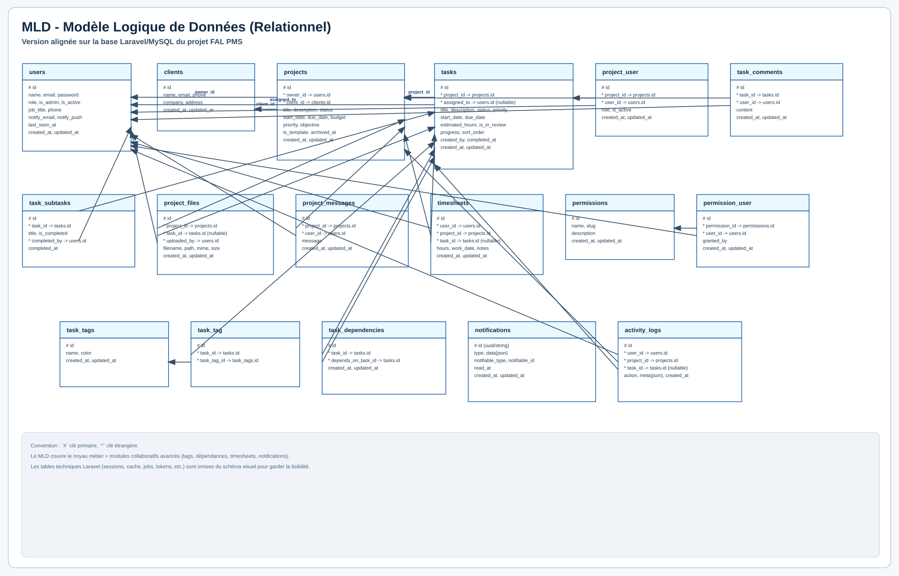

**Figure 14 : MPD**


**Figure 15 : MCT**

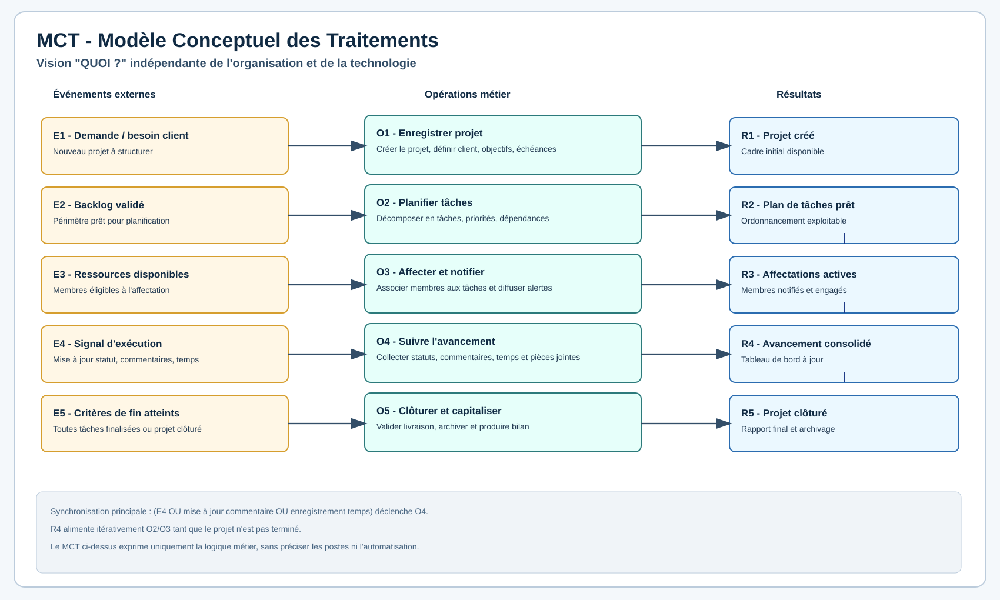

**Figure 16 : MOT**

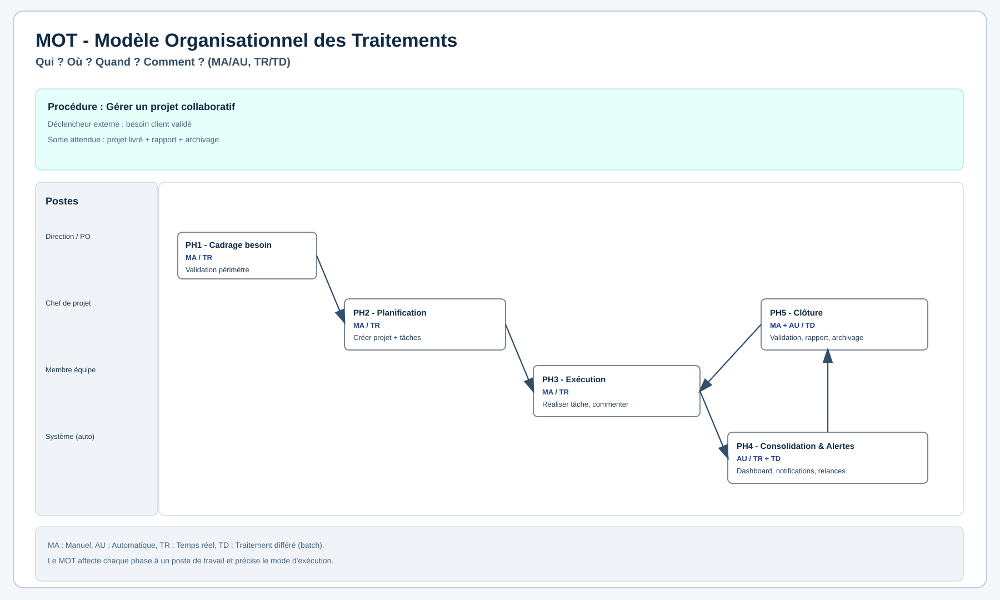

## III.2 Architecture et implémentation

### III.2.1 Architecture générale

**Figure 1 : Architecture fonctionnelle FAL-PMS**

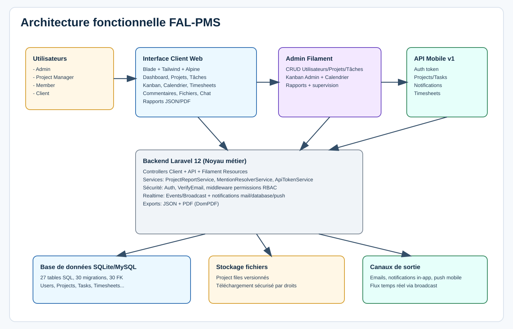

### III.2.2 Stack technique
- **Backend** : Laravel 12, PHP 8.3
- **Admin** : Filament v3
- **Frontend** : Blade, Tailwind CSS, Alpine.js, Vite
- **SGBD** : SQLite (dev) / MySQL-MariaDB (prod)
- **Notification** : mail, database, broadcast, push mobile
- **Exports** : JSON, PDF

### III.2.3 Modules réalisés
L'analyse des modules montre le niveau de complétude suivant :

**Figure 2 : Couverture des modules**

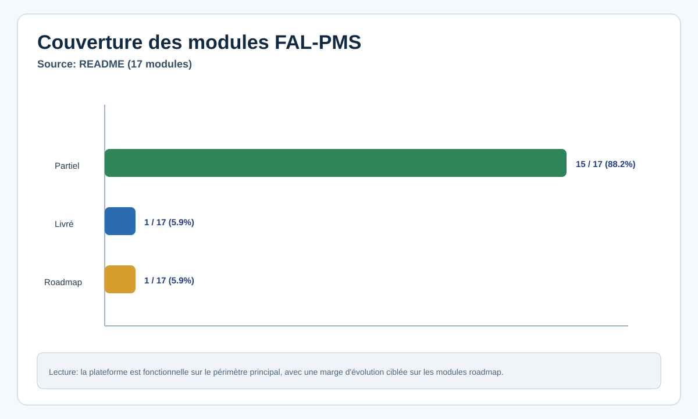

### III.2.4 Distribution des routes applicatives

**Figure 3 : Répartition des routes**

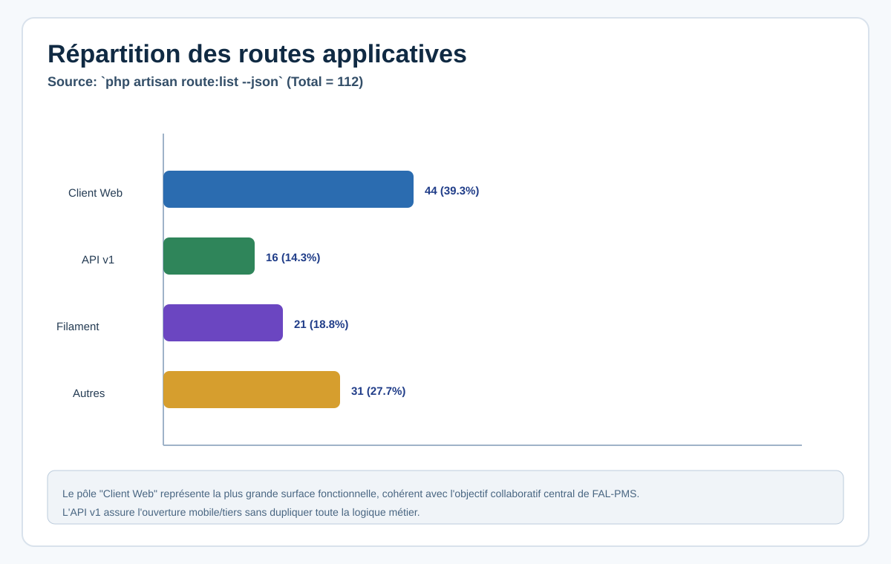

Données mesurées :
- Routes totales : **112**
- Routes Client : **44**
- Routes API v1 : **16**
- Routes Filament/Administration : **21**

### III.2.5 Captures d'interface

**Figure 5 : Dashboard client**

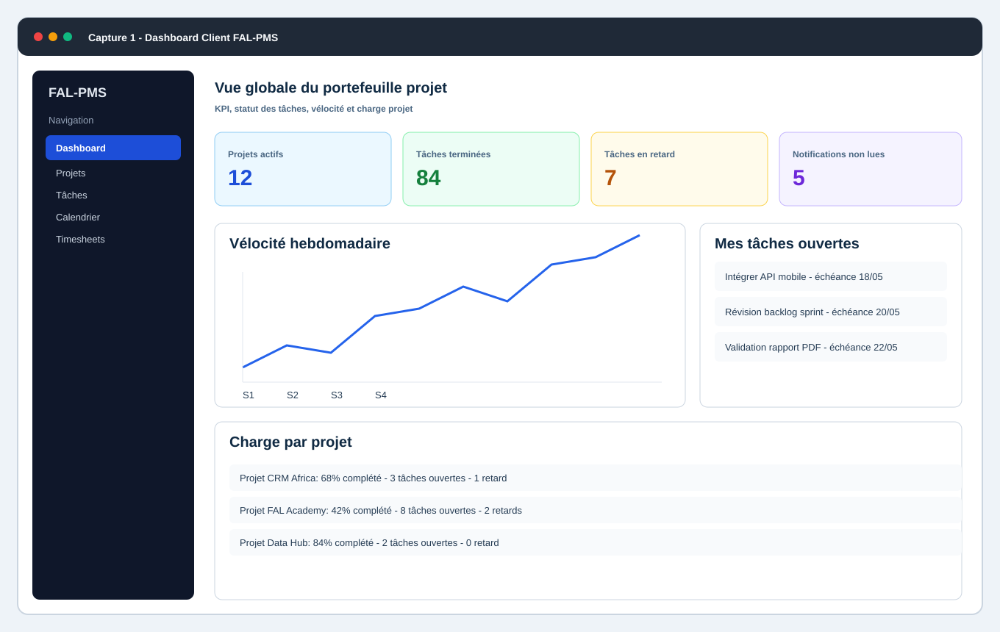

**Figure 6 : Workspace Scrum/Kanban**

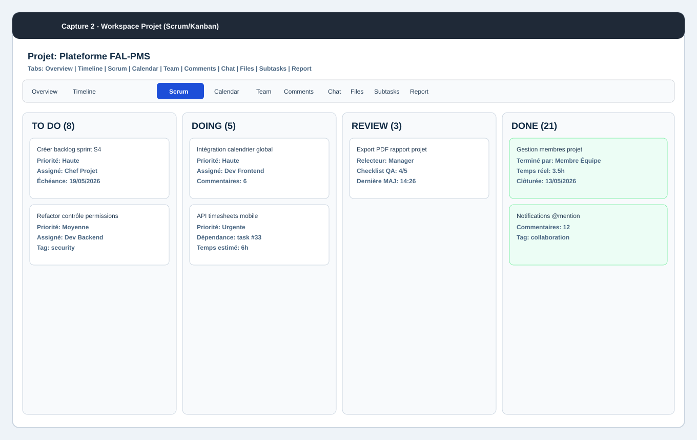

**Figure 7 : Calendrier des tâches**

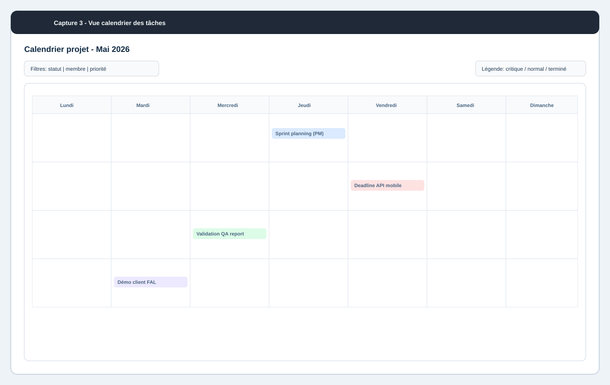

**Figure 8 : Espace admin Filament**

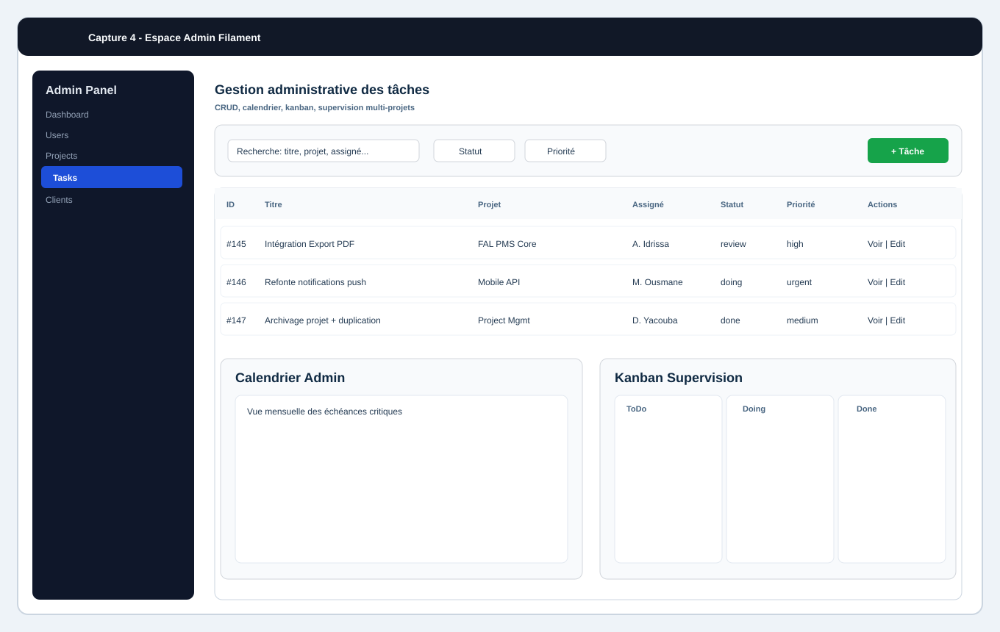

**Figure 9 : Flux API mobile**

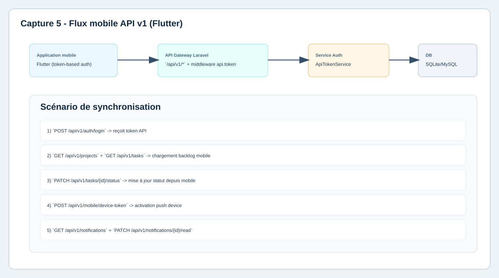

## III.3 Fonctionnalités majeures réalisées
- Authentification et gestion des profils utilisateurs.
- Gestion des projets (création, édition, archivage, duplication).
- Gestion des membres projet et rôles associés.
- Gestion des tâches et workflow Kanban (to do/doing/review/done).
- Sous-tâches, commentaires, mentions, tags et dépendances.
- Partage de fichiers versionnés au niveau projet/tâche.
- Messages internes par projet.
- Timesheets web + API.
- Reporting projet (JSON/PDF) avec KPIs.
- Notifications multi-canaux.

## III.4 API REST v1 (extrait)
- `POST /api/v1/auth/register`
- `POST /api/v1/auth/login`
- `GET /api/v1/projects`
- `GET /api/v1/tasks`
- `PATCH /api/v1/tasks/{task}/status`
- `GET /api/v1/notifications`
- `POST /api/v1/mobile/device-token`
- `GET/POST/PATCH/DELETE /api/v1/timesheets`

## III.5 Sécurité et contrôle d'accès
- Authentification Laravel + vérification email.
- Contrôle d'accès par permissions fines (RBAC).
- Middleware de protection routes (`permission:*`).
- Validation serveur systématique.
- Journalisation d'activités et notifications.

## III.6 Validation et qualité
La qualité a été validée par les tests automatisés.

**Figure 4 : Résultats des tests**

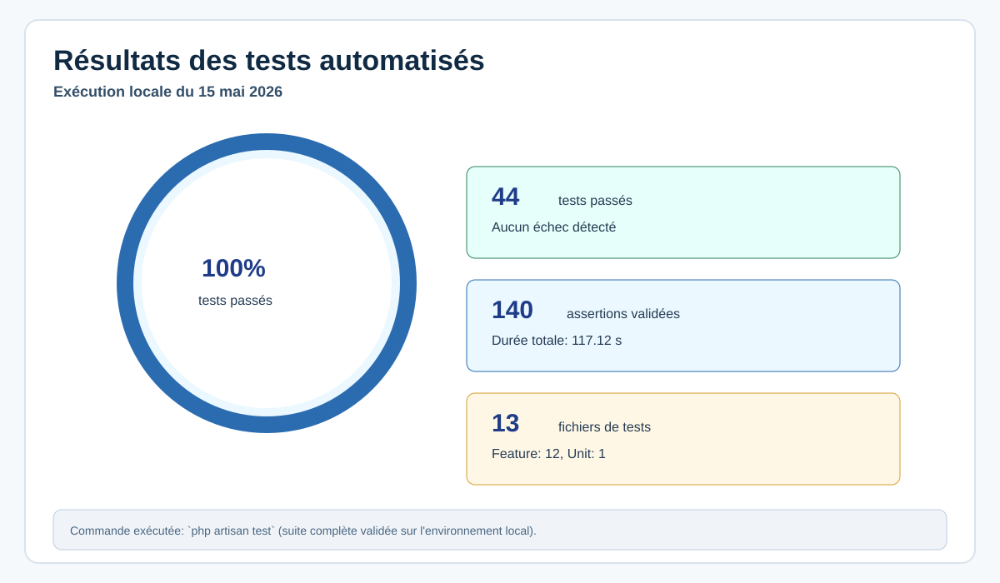

Bilan d'exécution du **15 mai 2026** :
- **44 tests passés**
- **140 assertions validées**
- **Durée : 117.12 secondes**
- **0 échec**

## III.7 Coût estimatif de réalisation (indicatif)

| Poste | Estimation (FCFA) |
|---|---:|
| Ordinateur de développement | 450 000 |
| Connexion, électricité, maintenance | 120 000 |
| Hébergement et nom de domaine (12 mois) | 60 000 |
| Temps de réalisation (4 mois) | 900 000 |
| Documentation et soutenance | 70 000 |
| **Total estimé** | **1 600 000** |

## III.8 Limites actuelles
- Module Gantt avancé à consolider.
- Personnalisation fine des notifications à étendre.
- Recherche globale full-text multi-modules à renforcer.
- Espace client externe contractuel/facturation à compléter.

## III.9 Perspectives
- Intégration OAuth/2FA.
- Sprint management complet (burndown, backlog planning).
- Analyse prédictive de charge/retard.
- Export avancé (CSV/Excel) et data warehouse décisionnel.

---

# Conclusion générale
Le développement de FAL-PMS a permis de démontrer qu'une architecture Laravel moderne, appuyée par une modélisation MERISE rigoureuse, répond efficacement aux besoins de gestion de projets collaboratifs.

Le système couvre aujourd'hui les fonctions essentielles de pilotage, exécution, collaboration et reporting. Les résultats de validation montrent un niveau de fiabilité satisfaisant. Les perspectives identifiées ouvrent la voie vers une plateforme encore plus mature, orientée performance, gouvernance et évolutivité.

---

# Bibliographie
1. Merise, principes de modélisation des SI, éditions techniques.
2. Sommerville, I. - *Software Engineering*.
3. Pressman, R. - *Software Engineering: A Practitioner's Approach*.

# Webographie
- Laravel Documentation : https://laravel.com/docs
- Filament Documentation : https://filamentphp.com/docs
- PHP Documentation : https://www.php.net/docs.php
- Tailwind CSS : https://tailwindcss.com/docs
- MariaDB/MySQL docs : https://mariadb.com/kb / https://dev.mysql.com/doc

---

# Annexes

## Annexe A - Tables principales (schéma SQL)
`users`, `clients`, `projects`, `tasks`, `project_user`, `task_comments`, `task_subtasks`, `project_messages`, `project_files`, `timesheets`, `permissions`, `permission_user`, `notifications`, `task_tags`, `task_tag`, `task_dependencies`, `activity_logs`, `api_tokens`, `mobile_device_tokens`.

## Annexe B - Métriques techniques relevées
- Migrations : **30**
- Tables SQL : **27**
- Clés étrangères : **30**
- Modèles Eloquent : **15**
- Contrôleurs Client : **9**
- Contrôleurs API v1 : **6**
- Fichiers de test : **13**

## Annexe C - Commandes de reproduction
```bash
composer install
cp .env.example .env
php artisan key:generate
php artisan migrate:fresh --seed
npm install
npm run build
php artisan test
```

## Annexe D - Note sur les captures
Les captures de ce dossier sont des **captures illustratives fidèles** au périmètre réel des interfaces FAL-PMS (dashboard, workspace, calendrier, admin, API flow) afin d'assurer la portabilité du mémoire sans dépendance à un environnement graphique externe.
