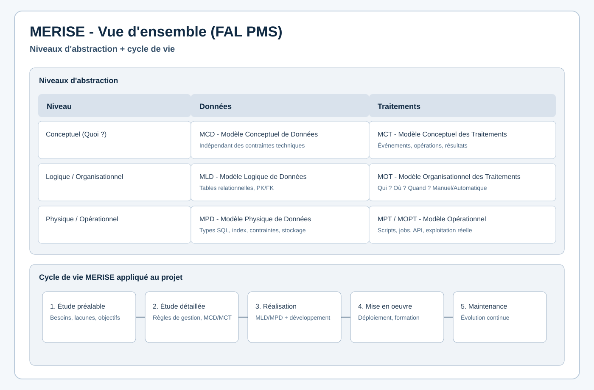
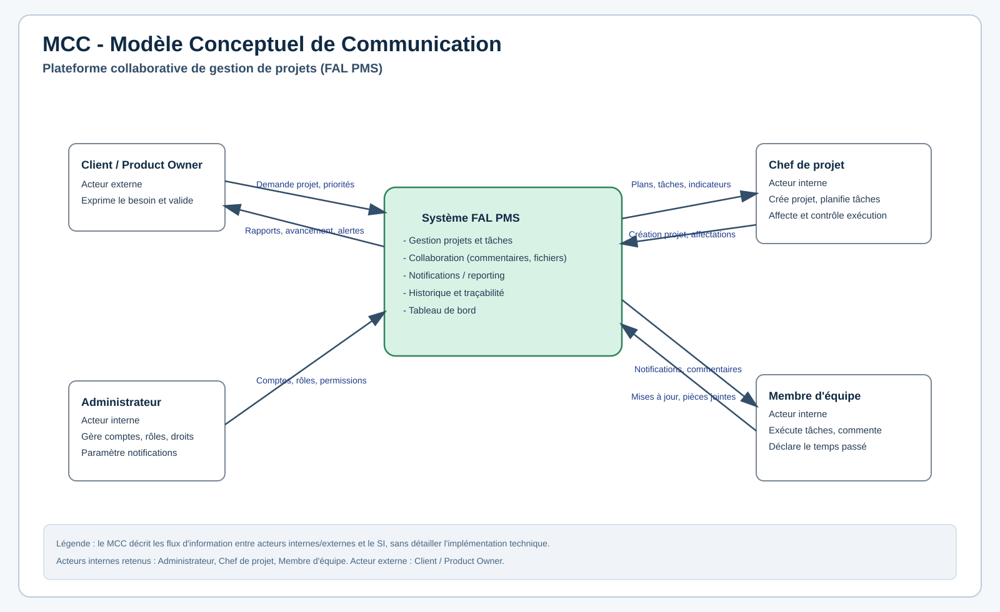
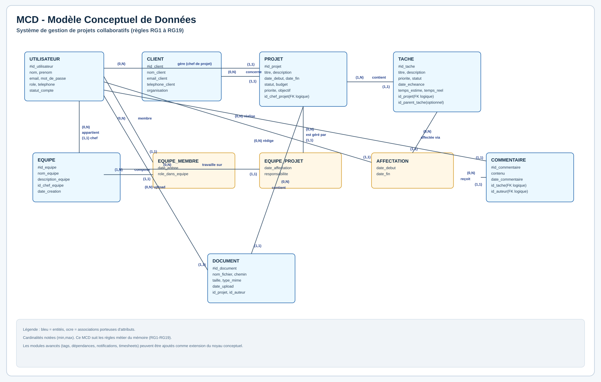
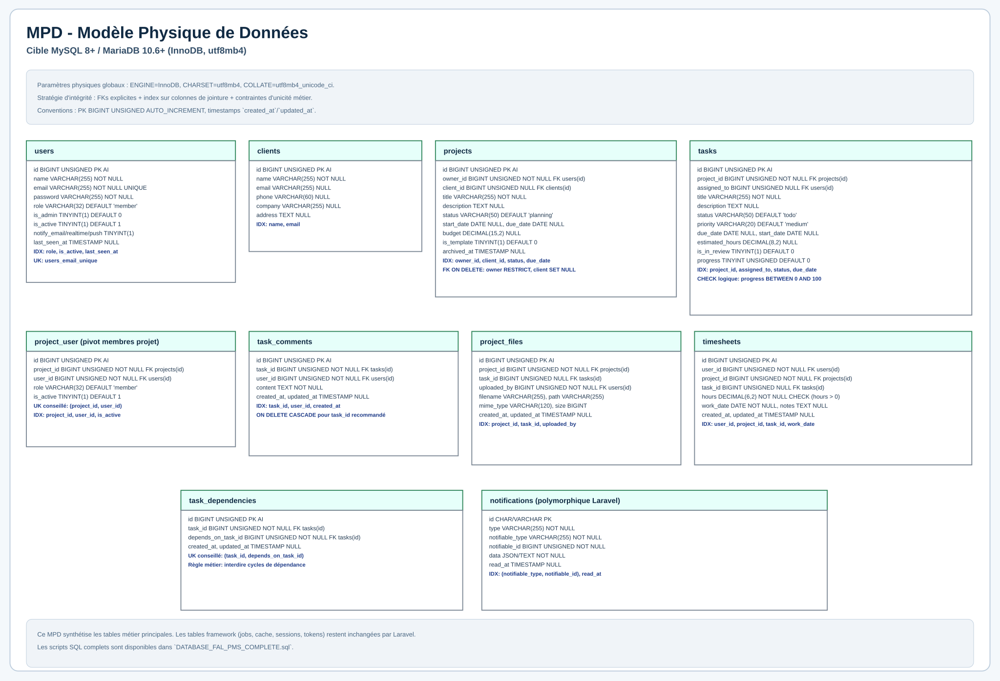

# MERISE Complet - FAL PMS

## 1) Vue d'ensemble MERISE

## 2) MCC - Modèle Conceptuel de Communication

## 3) MCD - Modèle Conceptuel de Données

## 4) MLD - Modèle Logique de Données

## 5) MPD - Modèle Physique de Données

## 6) MCT - Modèle Conceptuel des Traitements

## 7) MOT - Modèle Organisationnel des Traitements

## Notes de cohérence

- Le **MCD** suit le besoin métier (règles RG1 à RG19).
- Le **MLD/MPD** sont alignés sur le schéma actuel Laravel/MySQL de l'application.
- Le format demandé est respecté en **SVG** (convertible en PNG).
